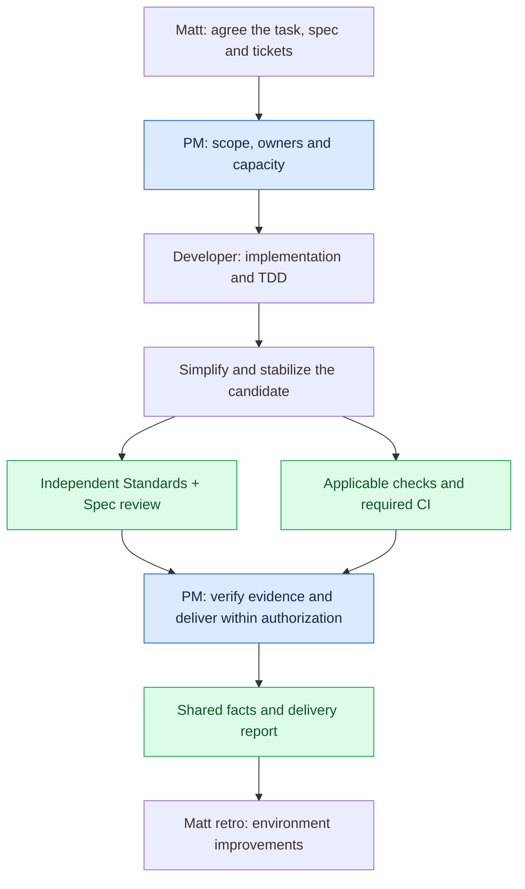
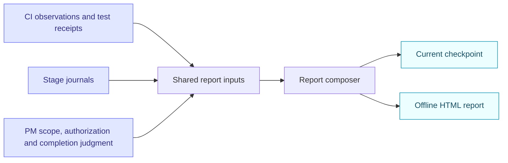

<div align="center">

# Composable Agent Skills

**Thin PM coordination · Focused engineering methods · Verifiable delivery**

Built to work with [Matt Pocock's skills](https://github.com/mattpocock/skills).

[](#included-skills) [](#delivery-tools) [](README.zh-CN.md)

**English** · [简体中文](README.zh-CN.md) · [Interactive walkthrough](docs/workflow.html)

</div>

Matt helps you decide what to build and provides the implementation, review, PR, and retrospective methods. This package coordinates an agreed task through delivery, adds three independently usable checks, and keeps CI observations and reports tied to evidence.

Use one coordinator and only the methods a task needs. A skill supplies instructions; it does not require another agent or another approval stage.

## Quick start

Install Matt and this package separately:

```sh
npx skills@latest add mattpocock/skills
npx skills@latest add CaiZongyuan/skills
```

Choose your coding agent and installation scope in the installer. Select all six package skills for the complete PM workflow, or choose individual methods for bounded work. The [skills CLI](https://github.com/vercel-labs/skills#options) supports `--agent codex` and `--global` when those are the intended targets.

For a new project, run Matt's `setup-matt-pocock-skills` to establish its tracker and document conventions. Reuse an existing project's configuration and glossary location. Keep upstream Matt files intact; project overrides belong in the project's own instructions.

Once the task or tickets are agreed:

```text
$pm-development Work the approved tickets within the existing scope.
Reuse valid evidence, consult the Advisor when warranted,
and report actual delivery and remaining work.
```

For an independent check:

```text
$change-impact Check this task's event-field change and its real consumers.
$check-benchmark Does this 200 ms to 120 ms report establish an improvement?
$verification-guide Reuse existing docs and prove one representative verification path.
```

## How the workflow fits together



Review and CI can overlap on a stable candidate. Required checks, public verification interfaces, resource ownership, and completion criteria come from the host project and the user's scope. A local preview stops at the authorized local result; an integration task verifies the actual merge.

Matt's `implement-spec` is an alternative coordinator for a whole spec. Choose it **or** PM Development to schedule that execution. Matt's `pr` presents verified evidence; `retro` uses the same receipts to recommend environment improvements.

## Included skills

| Skill | One job | Use it when |
| --- | --- | --- |
| [pm-development](skills/pm-development/SKILL.md) | Own scope, scheduling, risk decisions, and actual delivery. | Multi-issue, milestone, or long-running work needs coordination. |
| [change-impact](skills/change-impact/SKILL.md) | Trace real consumers and prove key safety or compatibility facts. | Shared APIs, types, dependencies, migrations, or ownership change. |
| [check-benchmark](skills/check-benchmark/SKILL.md) | Check that a performance claim measures correct, comparable work. | Reporting a speedup, regression, or measured choice. |
| [verification-guide](skills/verification-guide/SKILL.md) | Reuse and prove the project's existing verification path. | Agents repeatedly rediscover how to launch, drive, and clean up the app. |
| [development-timeline](skills/development-timeline/SKILL.md) | Project shared facts into a checkpoint and offline delivery report. | Delivery, waits, rework, a pause, or a retrospective needs evidence. |
| [reduce-complexity](skills/reduce-complexity/SKILL.md) | Simplify a bounded change or survey an integrated epic. | Behavior works and final validation or review is approaching. |

The existing Developer or Reviewer can use a relevant method and return its result to the same task. Ordinary work may need none of the three specialist methods.

## Optional frontend companions

Install these from their upstream repositories when they match the project. They complement this workflow and are not bundled into this package.

| Skill | Role in the workflow | Official source |
| --- | --- | --- |
| `vercel-react-best-practices` | React / Next.js implementation and review: rendering, data fetching, bundles, and performance. | [Vercel agent skills](https://github.com/vercel-labs/agent-skills) |
| `agent-browser` | Drive real browser journeys, inspect the page, and capture interaction or screenshot evidence. | [agent-browser](https://github.com/vercel-labs/agent-browser) |
| `shadcn` | Compose, add, style, or debug components in projects using shadcn/ui. | [shadcn skills documentation](https://ui.shadcn.com/docs/skills) |

```sh
npx skills@latest add vercel-labs/agent-skills --skill vercel-react-best-practices
npx skills@latest add vercel-labs/agent-browser --skill agent-browser
npx skills@latest add shadcn/ui --skill shadcn
```

Use React guidance during the relevant implementation or review. Use `shadcn` when the project actually uses shadcn/ui. Use browser tooling for the approved user journey and viewport scope, reusing existing valid evidence.

<details>
<summary>agent-browser: prepare the executable and browser</summary>

The skill installs agent instructions. Browser execution also needs the CLI and a browser runtime. If your environment does not already provide them, follow the [official setup](https://github.com/vercel-labs/agent-browser#installation):

```sh
npm install -g agent-browser
agent-browser install
```

On Linux, the upstream tool also provides `agent-browser install --with-deps` when system dependencies are needed. These setup commands affect the runtime environment; install the skill and prepare the browser as separate steps.

</details>

## Advisor

The Advisor is an independent, read-only consultation role for major decisions, repeated failures without new evidence, or conflicting review findings. PM provides a narrow question, contract, alternatives, and original evidence, then evaluates the recommendation.

Use the host's available subagent and model capabilities. The [consultation protocol](skills/pm-development/references/advisor.md) does not require Cursor's plugin or a separate installed skill. Advice informs the next action; independent review, required CI, and delivery verification retain their own responsibilities.

## Delivery tools

The helpers use **Node.js 18+ with no npm dependencies**. CI observation also needs an authenticated `gh` CLI. Third-party frontend tools follow their own setup requirements.



- **[CI observer](skills/pm-development/references/ci-observer.md):** reads an explicit GitHub repository and PR, saves head/run/attempt facts, and notifies only on meaningful changes. Failed observations remain distinct from last known CI results.
- **[Report composer](skills/development-timeline/references/composition.md):** reads explicit PM decisions, journals, and optional CI snapshots, then generates `current.md` and HTML from one model. Source inputs stay unchanged; CI success never decides task completion.

Keep task-specific receipts under the host project's directory, such as `.scratch/<task>/`. Generic methods and scripts live in this package. The tools read facts and produce local files; they do not trigger CI, update issues, or merge changes.

Run helper regression tests from this repository:

```sh
node --test skills/pm-development/tests/*.test.mjs skills/development-timeline/tests/*.test.mjs
```

## Walkthrough and design sources

[Open the Chinese workflow walkthrough](docs/workflow.html) for staged examples, Advisor conversations, actual skill snapshots, and the retrospective-to-implementation mapping. Download the HTML and open it locally; it works without a server or CDN.

The first version incorporates early checks of risky test assertions, known fixture risks, short feedback, shared-input reporting, and scheduling by actual blockers. Product-specific CI or runner changes remain product work; no delivery-speed improvement is claimed without comparable observations.

Methods draw on [Matt Pocock's skills](https://github.com/mattpocock/skills), [pstack](https://github.com/cursor/plugins/tree/df581122cde17e6e27686b5a448bde23e4ad4318/pstack), and [Advisor](https://github.com/cursor/plugins/tree/df581122cde17e6e27686b5a448bde23e4ad4318/advisor). All skills follow the user's authorization, host instructions, accepted decisions, and actual capabilities. Reports explain delivery; they add no merge gate.
