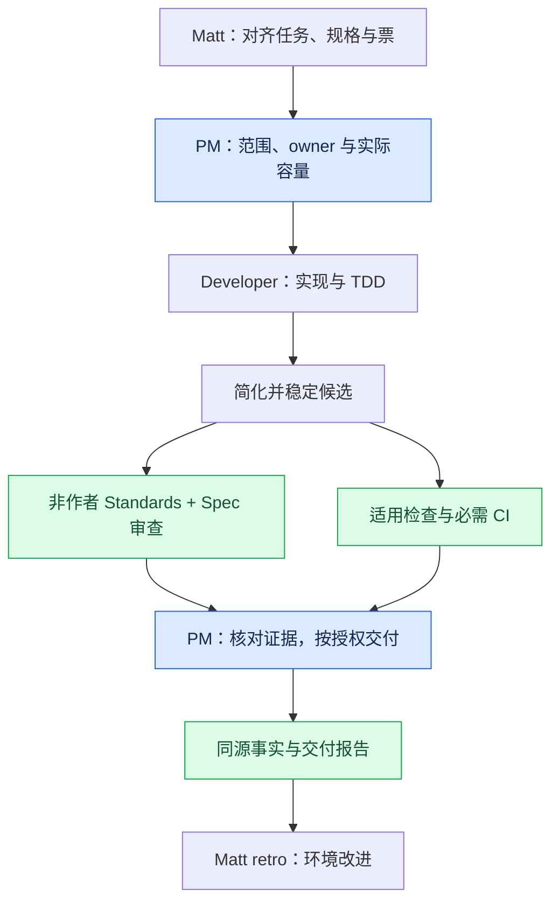
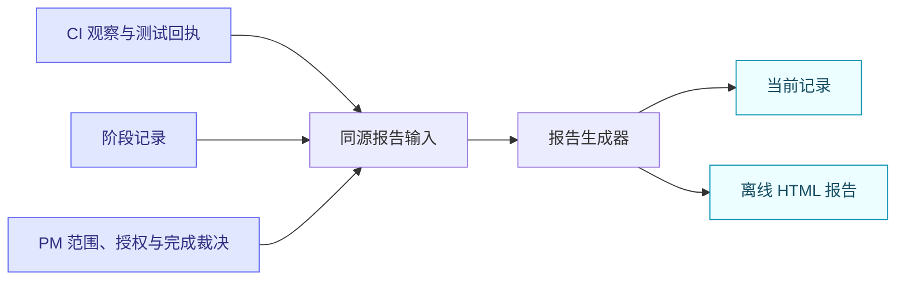

<div align="center">

# 可组合的 Agent 开发技能

**薄 PM 协调 · 专注的工程方法 · 有证据的交付**

默认配合 [Matt Pocock 技能系列](https://github.com/mattpocock/skills) 使用。

[](#包含的技能) [](#交付工具) [](README.md)

[English](README.md) · **简体中文** · [交互式流程讲解](docs/workflow.html)

</div>

Matt 帮你确定要做什么，并提供实现、审查、PR 和复盘的方法。本仓库负责把明确任务带到交付，补充三个可独立使用的检查方法，让 CI 观察与报告都有事实来源。

一次执行只有一个协调者，按任务选择需要的方法。技能是工作说明，不会要求另开一个 Agent 或增加一次审批。

## 快速开始

分别安装 Matt 和本仓库的技能：

```sh
npx skills@latest add mattpocock/skills
npx skills@latest add CaiZongyuan/skills
```

在安装器中选择对应 Agent 和安装范围。完整 PM 流程可选择下方六个技能；有界小任务也可只安装单个方法。[skills CLI](https://github.com/vercel-labs/skills#options) 支持 `--agent codex` 和 `--global`，按实际需要指定。

新项目可以运行 Matt 的 `setup-matt-pocock-skills`，确定 tracker 和文档约定。已有项目沿用现成配置和词汇表位置。Matt 上游文件保持原样，项目覆盖放在项目自己的说明中。

任务或票已经明确后，可以这样调用：

```text
$pm-development 按现有范围推进已批准的票。
复用有效证据，必要时咨询 Advisor，
最后说明实际交付结果与未完成部分。
```

独立检查也可以直接调用：

```text
$change-impact 检查这次事件字段修改与真实消费者。
$check-benchmark 这份 200ms→120ms 的报告能否证明优化？
$verification-guide 复用已有文档，走通一个代表性的验证路径。
```

## 整个流程怎样配合



稳定候选的审查和 CI 可以并行。必需检查、公开验证入口、资源所有权和完成条件由项目规范与用户范围决定。本地预览交付到已授权的本地结果；集成任务核对真实 merge。

Matt 的 `implement-spec` 是整份规格的另一种协调入口，一次执行选择它或 `pm-development` 负责调度。Matt 的 `pr` 呈现已验证证据，`retro` 读取同一份记录提出环境改法。

## 包含的技能

| 技能 | 专注的一件事 | 什么时候使用 |
| --- | --- | --- |
| [pm-development](skills/pm-development/SKILL.md) | 负责范围、调度、风险裁决与实际交付。 | 跨票、里程碑或长程工作需要协调。 |
| [change-impact](skills/change-impact/SKILL.md) | 追踪真实消费者，证明关键安全或兼容事实。 | 修改共享 API、类型、依赖、迁移或资源所有权。 |
| [check-benchmark](skills/check-benchmark/SKILL.md) | 核对性能结论是否测量了正确、可比的工作。 | 报告提速、回归或通过测量选择方案。 |
| [verification-guide](skills/verification-guide/SKILL.md) | 复用并走通项目现有验证路径。 | Agent 反复摸索怎样启动、操作和清理应用。 |
| [development-timeline](skills/development-timeline/SKILL.md) | 从同源事实生成当前记录和离线交付报告。 | 需要用证据讲清交付、等待、返工、暂停或复盘。 |
| [reduce-complexity](skills/reduce-complexity/SKILL.md) | 简化有界修改，或调查已集成 Epic 的维护机会。 | 行为已做通，即将进行最终验证或审查。 |

已有 Developer 或 Reviewer 可以使用相应方法，结果回到同一个任务。普通工作可能完全不需要三个专业检查技能。

## 可选的前端配套技能

项目适用时，从官方仓库单独安装。它们配合当前流程使用，不包含在本技能包中。

| 技能 | 在流程中做什么 | 官方来源 |
| --- | --- | --- |
| `vercel-react-best-practices` | React / Next.js 实现和审查：渲染、取数、包体及性能。 | [Vercel agent skills](https://github.com/vercel-labs/agent-skills) |
| `agent-browser` | 操作真实浏览器旅程、检查页面，保存交互或截图证据。 | [agent-browser](https://github.com/vercel-labs/agent-browser) |
| `shadcn` | 在使用 shadcn/ui 的项目中组合、添加、调整或调试组件。 | [shadcn 技能文档](https://ui.shadcn.com/docs/skills) |

```sh
npx skills@latest add vercel-labs/agent-skills --skill vercel-react-best-practices
npx skills@latest add vercel-labs/agent-browser --skill agent-browser
npx skills@latest add shadcn/ui --skill shadcn
```

React 实现和审查按需使用性能指南；项目使用 shadcn/ui 时使用 `shadcn`。浏览器操作覆盖已批准的用户路径和视口范围，已有有效证据直接复用。

<details>
<summary>agent-browser：准备执行工具与浏览器</summary>

安装技能得到的是 Agent 的工作说明。实际浏览器操作还需要 CLI 和浏览器运行时。如果环境尚未提供，按[官方安装说明](https://github.com/vercel-labs/agent-browser#installation)准备：

```sh
npm install -g agent-browser
agent-browser install
```

Linux 缺少浏览器系统依赖时，上游也提供 `agent-browser install --with-deps`。这类命令会改变运行环境，技能安装与浏览器准备是两个步骤。

</details>

## Advisor 顾问

Advisor 是重大决策、重复失败却没有新证据、或审查意见冲突时使用的独立只读顾问。PM 提供具体问题、合同、候选和原始证据，再判断是否采纳建议。

使用当前环境实际可用的子 Agent 与模型能力。[咨询协议](skills/pm-development/references/advisor.md)不要求安装 Cursor 插件或独立技能。建议用于选择下一行动，非作者审查、必需 CI 和交付核对仍各自承担职责。

## 交付工具

配套脚本需要 **Node.js 18+，没有 npm 依赖**。CI 观察还需要已认证的 `gh` CLI。第三方前端工具遵循各自的安装要求。



- **[CI 观察器](skills/pm-development/references/ci-observer.md)：**读取明确的 GitHub 仓库与 PR，保存 head/run/attempt 事实，只对有意义的变化通知。观察失败与最后已知的 CI 结果分开。
- **[同源报告生成器](skills/development-timeline/references/composition.md)：**读取 PM 明确写出的决策、阶段记录及可选 CI 快照，从同一个模型生成 `current.md` 和 HTML。源输入保持完整，CI 绿色不替 PM 判定任务完成。

本轮任务的回执放在项目自己的目录中，例如 `.scratch/<task>/`；通用方法和脚本保存在本仓库。工具读取事实并生成本地文件，不触发 CI、不更新 issue、不合并修改。

在本仓库运行工具回归检查：

```sh
node --test skills/pm-development/tests/*.test.mjs skills/development-timeline/tests/*.test.mjs
```

## 讲解与方法来源

[打开中文流程讲解](docs/workflow.html)，查看逐阶段例子、Advisor 对话、实际技能快照，以及复盘建议的落地对应表。下载 HTML 后本地打开即可，无需服务或 CDN。

第一版吸收了高风险判据预审、已知夹具风险处理、短反馈、同源报告和按实际阻塞调度等经验。项目 CI 和业务 runner 改造仍由产品任务实施；没有可比观测时，不宣称流程已经提速。

方法参考 [Matt Pocock 技能系列](https://github.com/mattpocock/skills)、[pstack](https://github.com/cursor/plugins/tree/df581122cde17e6e27686b5a448bde23e4ad4318/pstack) 和 [Advisor](https://github.com/cursor/plugins/tree/df581122cde17e6e27686b5a448bde23e4ad4318/advisor)。全部技能遵循用户授权、项目指令、已接受决策和实际可用能力。报告讲清交付，不增加合并关卡。
